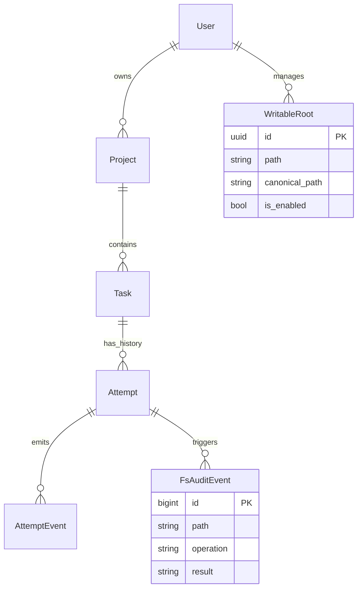

# Database Architecture (Implementation Spec)

## 1. Schema Diagram (ERD)

## 2. Table Definitions

### `projects_project`
| Column | Type | Constraints | Description |
| --- | --- | --- | --- |
| `id` | UUID | PK | |
| `owner_id` | UUID | FK(users_user) | |
| `name` | VARCHAR(255) | NOT NULL | |
| `repo_path` | VARCHAR(1024) | NOT NULL | Absolute path |
| `config` | JSONB | Default `{}` | |

### `local_access_writableroot` (NEW)
| Column | Type | Constraints | Description |
| --- | --- | --- | --- |
| `id` | UUID | PK | |
| `owner_id` | UUID | FK(users_user) | |
| `path` | VARCHAR(1024) | NOT NULL | User-provided display string |
| `canonical_path` | VARCHAR(1024) | NOT NULL | Resolved absolute path from LDA |
| `is_enabled` | BOOLEAN | Default True | Quick toggle without deleting |
| `created_at` | TIMESTAMPTZ | Default Now | |

### `local_access_fsauditevent` (NEW)
| Column | Type | Constraints | Description |
| --- | --- | --- | --- |
| `id` | BIGSERIAL | PK | |
| `owner_id` | UUID | FK(users_user) | |
| `attempt_id` | UUID | FK(attempts_attempt), NULL | Null if op unrelated to specific attempt |
| `task_id` | UUID | FK(tasks_task), NULL | |
| `operation` | VARCHAR(20) | NOT NULL | READ/WRITE/DELETE/MKDIR |
| `path` | TEXT | NOT NULL | |
| `canonical_path` | TEXT | NOT NULL | |
| `result` | VARCHAR(20) | NOT NULL | ALLOWED / DENIED |
| `reason` | TEXT | NULL | e.g. "Outside writable root" |
| `timestamp` | TIMESTAMPTZ | Default Now | |

### `attempts_attempt`
| Column | Type | Constraints | Description |
| --- | --- | --- | --- |
| `id` | UUID | PK | |
| `task_id` | UUID | FK(tasks_task) | |
| `status` | VARCHAR(50) | Default 'QUEUED' | |
| `branch_name` | VARCHAR(255) | NOT NULL | |
| `exit_code` | INT | NULL | |

### `tasks_task` Updates (NEW)
| Column | Type | Constraints | Description |
| --- | --- | --- | --- |
| `agent_role` | VARCHAR(50) | NOT NULL | One of: PM, FRONTEND, BACKEND, QA, DEVOPS |
| `dependencies` | JSONB | NULL | Array of task IDs that must complete first |

### `local_access_pmdecomposition` (NEW)
| Column | Type | Constraints | Description |
| --- | --- | --- | --- |
| `id` | UUID | PK | |
| `project_id` | UUID | FK(projects_project) | |
| `user_prompt` | TEXT | NOT NULL | User's project description |
| `pm_response` | TEXT | NOT NULL | PM agent's analysis |
| `tasks_created` | JSONB | NOT NULL | Array of created task IDs |
| `created_at` | TIMESTAMPTZ | Default Now | |

## 3. Indexing Strategy
1. **Audit Logs:**
   - `CREATE INDEX idx_audit_owner_ts ON local_access_fsauditevent(owner_id, timestamp DESC);`
   - `CREATE INDEX idx_audit_attempt ON local_access_fsauditevent(attempt_id);`
2. **Writable Roots:**
   - `CREATE INDEX idx_roots_canonical ON local_access_writableroot(owner_id, canonical_path);`
3. **Tasks by Role:**
   - `CREATE INDEX idx_tasks_role ON tasks_task(project_id, agent_role);`
   - Optimizes filtering/querying tasks by agent role

## 4. Constraints & Triggers
- **Canonical Path:** Ensure `canonical_path` is normalized (no trailing slashes, resolved symlinks) to make exact matching reliable. Logic handled by Application/LDA, but DB stores the result.
- **Agent Role Validation:** Application-level validation ensures `agent_role` is one of the allowed values (PM, FRONTEND, BACKEND, QA, DEVOPS).

