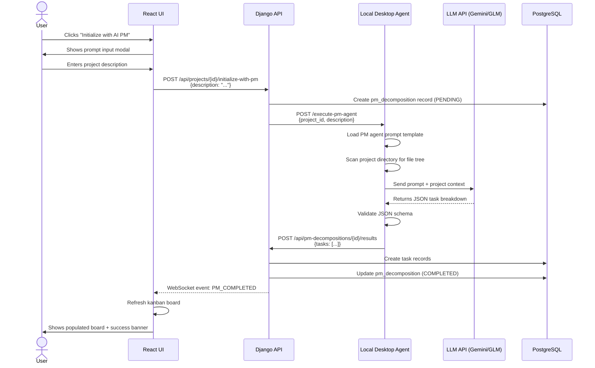
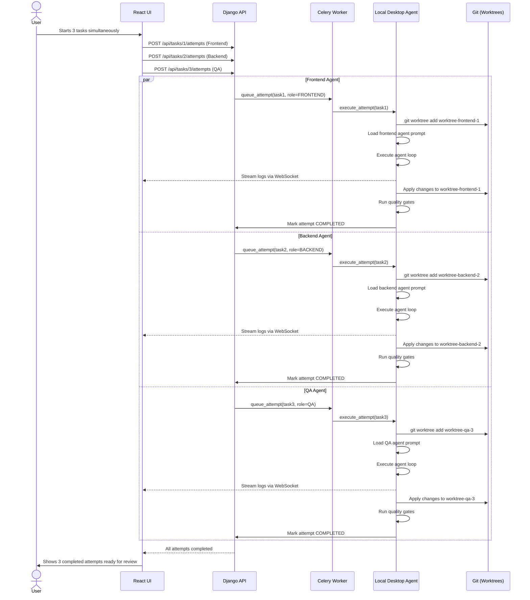

# PRD — Agent Company (Multi-Agent Development Platform)

## 0. Document Control
- **Product Name:** Agent Company
- **Version:** v1.3 (Enhanced Multi-Agent + Filesystem Permission Model)
- **Last Updated:** 2026-01-16
- **Target Release:** MVP+
- **Document Owner:** Product Team
- **Status:** In Review

---

## 1. Executive Summary

**Agent Company** is an AI-powered development orchestration platform that combines Kanban project management with multi-agent code execution. The platform enables developers to create projects backed by git repositories, define tasks as cards, and leverage specialized AI agents to implement features in isolated workspaces with real-time streaming logs and automated code review.

### Key Innovation: Multi-Agent Role System
Each project is staffed by five specialized AI agents working in parallel:
- **Project Manager (PM) Agent:** Decomposes requirements into structured, prioritized tasks
- **Frontend Developer Agent:** Implements UI/UX components and client-side logic  
- **Backend Developer Agent:** Builds server-side APIs, business logic, and data models
- **QA Engineer Agent:** Creates comprehensive test suites and ensures quality
- **DevOps Agent:** Manages infrastructure, deployment pipelines, and monitoring

### Workflow Overview
1. User describes project goals to the PM Agent
2. PM Agent generates a comprehensive task breakdown assigned to appropriate roles
3. Specialized agents execute tasks in parallel using isolated git worktrees
4. Each agent produces reviewable artifacts (diffs, tests, logs)
5. User reviews and approves changes for merge

### Local Filesystem Integration
The platform includes a **Local Desktop Agent (LDA)** — a companion daemon installed on the user's machine that enables:
- **Full read access** to local directories (with explicit OS consent)
- **Restricted write/delete access** limited to user-approved folders
- Real-time audit trail of all filesystem operations
- Secure, policy-enforced local operations

### Target Users
- Solo developers and builders automating development workflows
- Students and learners accelerating coding projects
- Small team leads managing AI-assisted development
- Local-first users who want agents to reference docs/config/code across their entire machine

---

## 2. Product Vision

**Vision Statement:**  
Democratize software development by enabling anyone to orchestrate AI agents that work like a complete development team, delivering production-quality code with transparency, safety, and user control.

**Strategic Goals:**
- Become the leading platform for AI-assisted multi-agent software development
- Enable 10x faster project completion through parallel agent execution
- Maintain 100% transparency and user control over all agent operations
- Build trust through comprehensive auditing and safety guarantees

**Product Principles:**
1. **Transparency First:** Users always know what agents are doing
2. **Safety by Default:** Strict permissions prevent accidental damage
3. **Developer Productivity:** Minimize friction, maximize output quality
4. **Modularity:** Pluggable agent framework for extensibility

---

## 3. Target Users & Personas

### Primary Persona: Alex — Solo Full-Stack Developer

**Demographics:**
- Age: 28
- Location: Remote/distributed
- Experience: 3-5 years full-stack development
- Tech stack: React, Django, PostgreSQL

**Goals:**
- Build MVPs faster to validate startup ideas
- Automate repetitive coding tasks (CRUD, boilerplate, tests)
- Learn best practices from agent-generated code
- Maintain high code quality without hiring a team

**Pain Points:**
- Context switching between frontend, backend, DevOps slows progress
- Writing tests is tedious but necessary
- Deployment setup takes days away from feature development
- Working alone means limited code review and quality feedback

**How Agent Company Helps:**
- PM Agent breaks down ideas into actionable tasks in minutes
- Specialized agents handle different stack layers simultaneously
- Automated test generation ensures quality without manual effort
- Built-in review workflow provides "second pair of eyes"

### Secondary Persona: Jordan — CS Student

**Demographics:**
- Age: 21
- Education: Computer Science undergrad
- Experience: 1-2 years, primarily academic projects
- Learning: Web development, deployment, best practices

**Goals:**
- Build impressive portfolio projects
- Learn industry-standard development workflows
- Understand how large codebases are structured
- Graduate with practical experience

**Pain Points:**
- Overwhelmed by modern web dev complexity (deployment, testing, CI/CD)
- Unclear how to structure larger projects
- Limited feedback on code quality
- Time-consuming to learn every technology

**How Agent Company Helps:**
- PM Agent teaches project decomposition skills
- Agent-generated code demonstrates best practices
- Audit logs provide learning trail of what changed and why
- Complete deployment automation removes DevOps barrier

### Tertiary Persona: Morgan — Small Team Lead

**Demographics:**
- Age: 35
- Role: Tech Lead at 5-person startup
- Experience: 8+ years, managing 2-3 developers
- Goal: Accelerate team velocity

**Pain Points:**
- Team bottlenecked on repetitive tasks
- Junior developers need more code review than seniors can provide
- Estimates are unreliable
- Context switching kills productivity

**How Agent Company Helps:**
- Agents handle boilerplate, letting humans focus on complex logic
- Automated quality gates catch issues before human review
- PM Agent provides realistic task breakdowns for estimation
- Parallel execution enables faster feature delivery

---

## 4. Problem Statement

### The Core Problem
**Modern software development requires expertise across multiple domains** (frontend, backend, database, testing, deployment), creating bottlenecks for solo developers and small teams. Context switching between these domains dramatically reduces productivity and increases cognitive load.

### Current Solutions & Limitations

**AI Code Assistants (e.g., GitHub Copilot, Cursor):**
- ❌ Single-agent approach lacks specialization
- ❌ No task orchestration or project management
- ❌ Limited context about local filesystem
- ❌ No built-in review or quality gates

**Traditional Kanban Tools (e.g., Jira, Trello):**
- ❌ Purely manual task tracking
- ❌ No code execution capabilities
- ❌ No integration with development workflow

**CI/CD Platforms (e.g., GitHub Actions):**
- ❌ Requires manual pipeline configuration
- ❌ No intelligent task decomposition
- ❌ No local filesystem integration

### Why This Matters
- **59% of developers** report context switching as their #1 productivity killer (Developer Survey 2025)
- **Average time to setup deployment** for new projects: 8-12 hours
- **Test coverage in solo projects:** typically <30% vs. industry standard 80%

---

## 5. Solution Overview

**Agent Company** solves these problems through three core innovations:

### 1. Multi-Agent Specialization
Instead of a single general-purpose AI, the platform deploys five specialized agents, each with:
- Role-specific prompts and best practices
- Dedicated knowledge base for their domain
- Isolated execution environments (git worktrees)
- Ability to work in parallel on independent tasks

### 2. Intelligent Orchestration (PM Agent)
A dedicated Project Manager agent that:
- Analyzes user requirements and codebase structure
- Generates comprehensive task breakdowns with dependencies
- Assigns tasks to appropriate specialist agents
- Identifies critical path and enables parallelization

### 3. Secure Local Filesystem Integration
A Local Desktop Agent that bridges web UI and local machine:
- Reads project documentation, config files, and code across the entire filesystem
- Enforces strict write permissions to user-approved folders only
- Provides real-time audit trail of all operations
- Operates entirely on user's machine (privacy-first)

### How It Works (User Flow)
```
1. User creates project → defines goals
         ↓
2. PM Agent → generates task breakdown
         ↓
3. Tasks distributed → Frontend/Backend/QA/DevOps agents
         ↓
4. Agents execute in parallel → isolated worktrees
         ↓
5. Auto-generated artifacts → diffs, tests, logs
         ↓
6. User reviews → approves/requests changes
         ↓
7. Changes merged → main branch updated
```

---

## 6. Success Metrics & KPIs

### 6.1 MVP+ Success Criteria

#### Product-Market Fit Metrics
| Metric | Target | Measurement Method |
|--------|--------|-------------------|
| **Time to First Task Completion** | < 10 minutes | Time from account creation to first approved task |
| **User Retention (Week 1)** | ≥ 60% | Users completing ≥ 1 task in first week |
| **Task Approval Rate** | ≥ 70% | % of agent-generated code approved without major changes |
| **Net Promoter Score (NPS)** | ≥ 40 | Post-project survey |

#### Agent Performance Metrics
| Metric | Target | Measurement Method |
|--------|--------|-------------------|
| **PM Agent Task Quality** | ≥ 85% | User rating: "Tasks were clear and actionable" |
| **Code Quality Gate Pass Rate** | ≥ 80% | % of attempts passing linting + tests on first try |
| **Parallel Execution Speedup** | ≥ 2.5x | Average time vs. sequential execution |
| **Merge Conflict Rate** | < 5% | % of worktree merges requiring manual conflict resolution |

#### Filesystem Safety Metrics
| Metric | Target | Measurement Method |
|--------|--------|-------------------|
| **Permission Clarity** | ≥ 90% | % of users correctly understanding writable folders (in-app quiz) |
| **Unauthorized Write Attempts** | 0 | Count of successful writes outside approved roots |
| **Audit Log Completeness** | 100% | % of write/delete operations recorded |

#### Technical Performance Metrics
| Metric | Target | Measurement Method |
|--------|--------|-------------------|
| **WebSocket Connection Stability** | ≥ 99% | Uptime during active attempts |
| **Event Stream Latency** | < 500ms | Time from LDA operation to UI update |
| **Concurrent Agents Supported** | ≥ 4 | Number of simultaneous agents per user |

### 6.2 North Star Metric
**Hours Saved Per Project** = Average time to complete project tasks manually - Time with Agent Company  
**Target:** Save ≥ 20 hours per mid-size project (50-100 tasks)

### 6.3 Analytics Implementation
- Track all metrics via PostgreSQL analytics tables
- Real-time dashboard for monitoring
- Weekly automated reports sent to stakeholders
- User feedback surveys triggered after project milestones

---

## 7. Feature Requirements

### 7.1 EPIC: Multi-Agent System

#### Feature 7.1.1: PM Agent — Project Initialization
**Priority:** P0 (Must-have for MVP+)

**Description:**  
When a user creates a new project, they interact with a PM Agent that analyzes their requirements and generates a structured task breakdown assigned to appropriate specialist agents.

**User Benefit:**  
Eliminates manual task decomposition, ensures comprehensive coverage, and enables immediate parallel execution.

**User Story:**  
As a developer, I want to describe my project goals in plain language so that the PM Agent can create a complete task breakdown without me manually planning every detail.

**Acceptance Criteria:**
- [ ] User can initiate PM Agent via "Initialize with AI" button on project detail page
- [ ] User provides project description in a text area (minimum 50 characters, maximum 5000)
- [ ] PM Agent responds within 30 seconds with task breakdown
- [ ] Generated tasks include: title, description, assigned role, priority (1-5)
- [ ] Tasks are automatically created in Kanban board in "TODO" column
- [ ] User can review and edit generated tasks before finalizing
- [ ] System displays PM Agent's reasoning/analysis for transparency
- [ ] Error handling: If PM Agent fails, show clear error and allow retry

**Technical Notes:**
- PM Agent uses structured prompt with project description + codebase file tree
- Output format: JSON array of tasks validated against schema
- Store PM decomposition in `pm_decompositions` table for audit trail

**Dependencies:**
- LLM API integration (GLM-7 or Gemini 2.5 Flash)
- Task creation API

---

#### Feature 7.1.2: Specialized Agent Execution
**Priority:** P0 (Must-have for MVP+)

**Description:**  
Each task is assigned to a specialized agent (Frontend/Backend/QA/DevOps) that executes with role-specific knowledge and best practices.

**User Benefit:**  
Higher quality code output compared to general-purpose agents, with faster execution through domain expertise.

**User Story:**  
As a developer, I want tasks to be executed by agents specialized in their respective domains so that generated code follows best practices for that technology stack.

**Acceptance Criteria:**
- [ ] Each task displays assigned agent role badge (color-coded icon)
- [ ] When task is started, correct specialized agent is invoked
- [ ] Agent uses role-specific system prompt and knowledge base
- [ ] Different agents can execute simultaneously on different tasks
- [ ] Agent role is immutable once task is created (prevents accidental reassignment)
- [ ] User can view agent role distribution across project (e.g., "30% Frontend, 40% Backend, 20% QA, 10% DevOps")

**Technical Notes:**
- Agent prompts stored in separate files per role: `prompts/frontend.txt`, `prompts/backend.txt`, etc.
- LDA receives `agent_role` in request payload and loads appropriate prompt
- Model selection per role stored in `AgentProfile` table

**Dependencies:**
- LDA agent adapter framework
- Task execution engine

---

#### Feature 7.1.3: Parallel Execution with Worktrees
**Priority:** P0 (Must-have for MVP+)

**Description:**  
Multiple agents execute tasks simultaneously in isolated git worktrees to prevent file conflicts and maximize throughput.

**User Benefit:**  
Dramatically faster project completion (2-4x speedup) compared to sequential execution.

**User Story:**  
As a developer, I want multiple agents to work on different tasks at the same time so that my project is completed faster.

**Acceptance Criteria:**
- [ ] Starting a task creates a new git worktree named `worktree-{role}-{task_id}`
- [ ] Worktrees are created in isolated directories outside main repo
- [ ] Up to 4 concurrent worktrees can be active per project
- [ ] Dashboard shows "Active Agents: 3/4" indicator
- [ ] Agent operations in one worktree do not affect others
- [ ] Upon completion, worktree is preserved until merge/rejection
- [ ] Rejected attempts' worktrees are cleaned up automatically after 7 days

**Technical Notes:**
- Use `git worktree add` command via LDA
- Worktree paths stored in `attempts` table: `worktree_path` column
- Cleanup handled by scheduled Celery task

**Dependencies:**
- Git 2.5+ (worktree support)
- LDA git operations module

---

#### Feature 7.1.4: Task Dependency Management
**Priority:** P1 (Should-have for MVP+)

**Description:**  
Tasks can declare dependencies on other tasks, preventing execution until prerequisites are completed and merged.

**User Benefit:**  
Ensures correct execution order for tasks that build on each other (e.g., API must exist before frontend consumes it).

**User Story:**  
As a developer, I want dependent tasks to wait for their prerequisites so that agents don't try to consume APIs that don't exist yet.

**Acceptance Criteria:**
- [ ] When creating/editing task, user can select prerequisite tasks from dropdown
- [ ] Task card displays dependency count (e.g., "Blocked by 2 tasks")
- [ ] "Start" button is disabled if dependencies are not completed
- [ ] Tooltip explains which specific tasks are blocking
- [ ] When prerequisite is completed, dependent tasks automatically move from "Blocked" to "Ready"
- [ ] Circular dependencies are detected and prevented with clear error message
- [ ] PM Agent automatically infers common dependencies (e.g., Backend API → Frontend Integration)

**Technical Notes:**
- Store dependencies as JSONB array: `dependencies: ["task-uuid-1", "task-uuid-2"]`
- Add index on `tasks(dependencies)` for query performance
- Dependency graph validation on save

**Dependencies:**
- Task data model with `dependencies` field

---

### 7.2 EPIC: Local Filesystem Integration

#### Feature 7.2.1: Writable Roots Configuration
**Priority:** P0 (Must-have for MVP+)

**Description:**  
Users explicitly select which folders on their local machine the Local Desktop Agent can write to or delete from. All other locations are read-only.

**User Benefit:**  
Complete peace of mind that agents cannot accidentally damage files outside project boundaries.

**User Story:**  
As a user, I want to control exactly which folders agents can modify so that I don't risk losing important files.

**Acceptance Criteria:**
- [ ] Settings page has "Local Access" section
- [ ] "Add Writable Folder" button opens native OS folder picker
- [ ] Selected folders appear in list with full path displayed
- [ ] Each folder has "Remove" button (with confirmation)
- [ ] System displays canonical path (resolved symlinks) alongside user path
- [ ] Default writable roots include detected project repos
- [ ] Empty state shows clear instructions and example screenshot
- [ ] Changes take effect immediately without restart
- [ ] System prevents adding system folders (C:\Windows, /System, etc.) with warning message

**Technical Notes:**
- Store in `writable_roots` table
- LDA computes canonical path using platform-specific functions (`os.path.realpath` / equivalent)
- Frontend uses File System Access API where supported, fallback to backend proxy

**Dependencies:**
- LDA local API
- Settings UI component

---

#### Feature 7.2.2: Permission Enforcement Engine
**Priority:** P0 (Must-have for MVP+)

**Description:**  
Before every write or delete operation, LDA validates that the target path is within a configured writable root, blocking unauthorized operations.

**User Benefit:**  
Zero risk of accidental file damage outside approved areas, regardless of agent behavior.

**User Story:**  
As a user, I want the system to enforce my permission rules so that even if an agent tries to write outside bounds, it's blocked.

**Acceptance Criteria:**
- [ ] All write/delete operations go through permission check before execution
- [ ] Permission check uses canonical paths (symlinks resolved)
- [ ] Blocked operations return error code + reason (e.g., "Path /etc/config not in writable roots")
- [ ] Blocked operations are logged to audit table with DENIED status
- [ ] Path traversal attempts (../, symlinks) are detected and blocked
- [ ] 100% of test cases for traversal exploits must fail
- [ ] Performance: Permission check completes in < 5ms per operation

**Technical Notes:**
- Implement in LDA: `filesystem_guardian` module
- Canonical path comparison: `os.path.commonpath([canonical_target, canonical_root]) == canonical_root`
- Include symlink depth limiting to prevent infinite loops

**Dependencies:**
- Writable roots configuration
- LDA core filesystem module

---

#### Feature 7.2.3: Filesystem Audit Log
**Priority:** P0 (Must-have for MVP+)

**Description:**  
Every filesystem operation (read, write, delete) is recorded with timestamp, path, operation type, and result (allowed/denied).

**User Benefit:**  
Complete transparency into what agents accessed and modified, enabling debugging and trust.

**User Story:**  
As a user, I want to see exactly what files agents touched so that I can review their actions and debug issues.

**Acceptance Criteria:**
- [ ] Audit view accessible from Settings → Local Access → Audit Log
- [ ] Table displays: Timestamp, Operation (Read/Write/Delete), Path, Task ID, Result (Allowed/Denied)
- [ ] Filter by: Task, Date range, Operation type, Result
- [ ] Search by path substring
- [ ] Pagination (50 entries per page)
- [ ] Export to CSV functionality
- [ ] For writes, display bytes written
- [ ] For denied operations, show reason
- [ ] Audit logs retained for 90 days (configurable)

**Technical Notes:**
- Store in `fs_audit_events` table
- Index on `(owner_id, ts DESC)` for efficient queries
- Batch writes to database (buffer up to 100 events or 5 seconds)
- Read operations are optional in MVP (can be very high volume)

**Dependencies:**
- `fs_audit_events` schema
- Audit UI component

---

#### Feature 7.2.4: Safe Delete (Trash/Quarantine)
**Priority:** P1 (Should-have for MVP+)

**Description:**  
Instead of permanently deleting files, agents move files to a quarantine folder where users can review and restore if needed.

**User Benefit:**  
Recovery option for accidental deletes, reducing anxiety about using the system.

**User Story:**  
As a user, I want deleted files to go to a recoverable trash so that I can undo if an agent deletes something important.

**Acceptance Criteria:**
- [ ] By default, delete operations move files to `.agent-company/trash/{task-id}/`
- [ ] Trash preserves original directory structure
- [ ] Trash view shows: Original path, Deleted timestamp, Task that deleted it
- [ ] User can "Restore" or "Permanently Delete" from trash
- [ ] Trash is automatically cleaned after 30 days
- [ ] Advanced setting: "Hard Delete Mode" (with big warning) bypasses trash
- [ ] Trash location is outside writable roots (in app data dir)

**Technical Notes:**
- Trash directory: Platform-specific app data folder
- Store metadata in `deleted_files` table for restoration
- Celery scheduled task for trash cleanup

**Dependencies:**
- LDA delete operation
- Trash UI component

---

### 7.3 EPIC: Kanban & Task Management

#### Feature 7.3.1: Dynamic Kanban Board
**Priority:** P0 (Must-have for MVP+)

**Description:**  
Visual drag-and-drop Kanban board with columns: TODO, IN PROGRESS, IN REVIEW, DONE. Cards display task info and agent role.

**User Benefit:**  
Clear project status visibility, intuitive task management, familiar workflow.

**User Story:**  
As a developer, I want to see all my project tasks in a Kanban board so that I can understand project status at a glance.

**Acceptance Criteria:**
- [ ] Board renders with 4 columns: TODO, IN PROGRESS, IN REVIEW, DONE
- [ ] Tasks are displayed as cards with title, role badge, priority indicator
- [ ] Drag and drop cards between columns
- [ ] Dragging to IN PROGRESS starts the agent if not already started
- [ ] Card count displayed in column headers (e.g., "TODO (12)")
- [ ] Color-coding by agent role (Frontend=blue, Backend=green, QA=yellow, DevOps=purple)
- [ ] Click card to open detail view
- [ ] Filter by agent role (show only Frontend tasks, etc.)
- [ ] Responsive: Works on mobile with swipe gestures

**Technical Notes:**
- Use `react-beautiful-dnd` or similar for drag-and-drop
- Real-time updates via WebSocket when other users move tasks (for future collaboration)
- Optimistic UI updates with rollback on error

**Dependencies:**
- Task CRUD APIs
- WebSocket infrastructure

---

#### Feature 7.3.2: Task Detail View
**Priority:** P0 (Must-have for MVP+)

**Description:**  
Detailed view of a task showing description, acceptance criteria, assigned agent, attempts history, and action buttons.

**User Benefit:**  
Complete context for task review and decision-making.

**User Story:**  
As a developer, I want to see all information about a task in one place so that I can review and approve agent work efficiently.

**Acceptance Criteria:**
- [ ] Opens in modal or side panel
- [ ] Displays: Title (editable), Description (editable), Agent Role (read-only), Priority (editable)
- [ ] Shows acceptance criteria as checklist
- [ ] Lists all attempts with status indicators (Success/Failed/In Progress)
- [ ] For completed attempts: View Diff, View Logs, Approve, Reject buttons
- [ ] For in-progress attempts: Live log stream, Cancel button
- [ ] Dependencies section shows linked tasks with status
- [ ] Comments section for user notes (future: agent conversation)
- [ ] "Start Agent" button triggers new attempt
- [ ] Close button returns to board

**Technical Notes:**
- Use React Query for data fetching and caching
- Markdown rendering for description
- Syntax-highlighted diff viewer

**Dependencies:**
- Task APIs
- Attempt APIs
- Diff viewer component

---

### 7.4 EPIC: Agent Execution & Review

#### Feature 7.4.1: Real-Time Log Streaming
**Priority:** P0 (Must-have for MVP+)

**Description:**  
As agent executes a task, logs stream in real-time to the UI showing each operation and its result.

**User Benefit:**  
Understand what agent is doing, catch issues early, build trust through transparency.

**User Story:**  
As a developer, I want to see live logs as the agent works so that I know it's making progress and can debug if something goes wrong.

**Acceptance Criteria:**
- [ ] Logs appear within 500ms of operation in LDA
- [ ] Each log line shows: Timestamp, Log level (Info/Warning/Error), Message
- [ ] Logs support ANSI color codes for readability
- [ ] Auto-scroll to latest log (with option to disable during review)
- [ ] Search/filter logs by keyword
- [ ] Logs persist after attempt completes
- [ ] Export logs as .txt file
- [ ] Connection lost indicator with auto-reconnect
- [ ] Handles high-volume logs (>1000 lines) without UI lag

**Technical Notes:**
- Use WebSocket connection from browser to Django Channels
- Django subscribes to Redis channel for specific attempt
- LDA publishes log events to Redis
- Frontend uses virtual scrolling for performance

**Dependencies:**
- Django Channels setup
- Redis
- LDA event publishing

---

#### Feature 7.4.2: Code Diff Viewer
**Priority:** P0 (Must-have for MVP+)

**Description:**  
Side-by-side or unified diff view showing exactly what code the agent changed, with syntax highlighting and inline comments.

**User Benefit:**  
Precise understanding of changes enables confident approval decisions.

**User Story:**  
As a developer, I want to review exactly what code changed so that I can approve or request modifications.

**Acceptance Criteria:**
- [ ] Diff view loads within 2 seconds for files up to 10,000 lines
- [ ] Toggle between unified diff and split view
- [ ] Syntax highlighting based on file extension
- [ ] Line numbers displayed
- [ ] Expand context lines (collapsed by default)
- [ ] Navigation: Jump to next/previous file
- [ ] File tree showing all changed files with change counts (+15 / -8)
- [ ] Support for binary file changes (show "Binary file changed")
- [ ] Diff stats summary (e.g., "15 files changed, 342 insertions(+), 128 deletions(-)")

**Technical Notes:**
- Backend generates unified diff using `git diff` in worktree
- Frontend uses `react-diff-view` or `monaco-diff-editor`
- Store diff as artifact: `artifacts/{attempt_id}/diff.patch`

**Dependencies:**
- Git diff generation in LDA
- Diff viewer library
- Artifact storage

---

#### Feature 7.4.3: Quality Gates (Tests + Linting)
**Priority:** P0 (Must-have for MVP+)

**Description:**  
After code generation, LDA automatically runs tests and linting checks, reporting pass/fail status before user review.

**User Benefit:**  
Confidence that agent-generated code meets basic quality standards, reducing review burden.

**User Story:**  
As a developer, I want the system to automatically test agent code so that I don't waste time reviewing broken implementations.

**Acceptance Criteria:**
- [ ] LDA runs tests after applying code changes
- [ ] LDA runs linting (ESLint, Pylint, etc. based on project config)
- [ ] Results displayed in attempt detail: ✓ Tests Passed (15/15) ✓ Linting Passed
- [ ] Failed gates show specific errors (e.g., "Test test_login_invalid_password failed")
- [ ] User can configure which gates are required vs. optional
- [ ] Attempt status includes quality gate results (PASSED_ALL_GATES / FAILED_GATES)
- [ ] Option to approve despite failed gates (with warning)
- [ ] Gate execution timeout: 10 minutes (configurable)

**Technical Notes:**
- LDA detects test framework from project structure (package.json, pytest.ini, etc.)
- Store gate results in `attempt_gate_results` table
- Parallel gate execution where possible

**Dependencies:**
- LDA test runner module
- Attempt status model

---

#### Feature 7.4.4: Approve / Reject Workflow
**Priority:** P0 (Must-have for MVP+)

**Description:**  
After reviewing attempt, user can approve (merge to main branch) or reject (close attempt, optionally with feedback).

**User Benefit:**  
Clear decision point with controls, enables iterative refinement.

**User Story:**  
As a developer, I want to approve good work and reject poor work so that only quality code makes it into my project.

**Acceptance Criteria:**
- [ ] "Approve" button is enabled only after attempt reaches terminal success state
- [ ] Approve action triggers merge from worktree to main branch
- [ ] Merge conflict detection: If conflicts exist, user is prompted to resolve manually
- [ ] Success message confirms merge: "Changes merged to main branch (commit abc123f)"
- [ ] Task automatically moves to DONE column after approval
- [ ] "Reject" button available at any time
- [ ] Reject modal allows optional feedback text sent to agent (future: for learning)
- [ ] Rejected attempts are marked as REJECTED, worktree cleaned up
- [ ] User can request modifications: "Reject with Changes" → generates new attempt

**Technical Notes:**
- LDA performs `git merge` or `git cherry-pick` depending on strategy
- Conflict resolution uses 3-way merge algorithm
- Store merge commit hash in `attempts.merge_commit` field

**Dependencies:**
- LDA git merge module
- Task status workflow

---

### 7.5 Non-Functional Requirements

#### 7.5.1 Performance
| Requirement | Target | Priority |
|-------------|--------|----------|
| Page load time (initial) | < 3 seconds | P0 |
| Task board rendering (100 tasks) | < 1 second | P0 |
| Agent spawn time | < 5 seconds | P0 |
| Log streaming latency | < 500ms | P0 |
| Diff rendering (5000 line file) | < 2 seconds | P1 |
| Concurrent users supported per instance | ≥ 50 | P1 |
| Database query response time (p95) | < 100ms | P0 |

#### 7.5.2 Security
| Requirement | Implementation | Priority |
|-------------|----------------|----------|
| Authentication | JWT tokens, HTTP-only cookies | P0 |
| API authorization | Permission classes on all DRF endpoints | P0 |
| WebSocket authentication | Token validation in Channels middleware | P0 |
| LDA ↔ Backend communication | TLS + short-lived signed tokens | P0 |
| Filesystem access control | Writable roots enforcement + canonical paths | P0 |
| SQL injection prevention | Django ORM (parameterized queries) | P0 |
| XSS prevention | React auto-escaping + CSP headers | P0 |
| CSRF protection | Django CSRF middleware | P0 |
| Rate limiting | 100 req/min per user (API), 10 req/min (LDA calls) | P1 |

#### 7.5.3 Reliability
| Requirement | Target | Priority |
|-------------|--------|----------|
| System uptime | 99.5% (excluding scheduled maintenance) | P0 |
| WebSocket reconnection | Automatic with exponential backoff | P0 |
| Agent failure recovery | Retry up to 2 times on transient errors | P1 |
| Data backup frequency | Daily automated backups | P0 |
| Disaster recovery RTO | 4 hours | P1 |

#### 7.5.4 Scalability
| Requirement | Target | Priority |
|-------------|--------|----------|
| Max tasks per project | 1,000 | P1 |
| Max concurrent agents per user | 4 | P0 |
| Max file size for diff viewing | 10 MB | P1 |
| Database storage plan | 100 GB initial, scale to 1 TB | P1 |

#### 7.5.5 Compatibility
| Category | Requirements | Priority |
|----------|-------------|----------|
| **Browser Support** | Chrome 100+, Firefox 100+, Safari 15+, Edge 100+ | P0 |
| **Operating Systems (LDA)** | Windows 10+, macOS 12+, Ubuntu 20.04+ | P0 |
| **Git Version** | Git 2.5+ (for worktree support) | P0 |
| **Python Version** | Python 3.9+ (Django backend) | P0 |
| **Node Version** | Node 18+ (Frontend build) | P0 |

#### 7.5.6 Accessibility
| Requirement | Standard | Priority |
|-------------|----------|----------|
| WCAG Compliance | WCAG 2.1 Level AA | P1 |
| Keyboard Navigation | All actions accessible via keyboard | P1 |
| Screen Reader Support | ARIA labels on interactive elements | P1 |
| Color Contrast | Minimum 4.5:1 for normal text | P1 |

---

## 8. Constraints & Dependencies

### 8.1 Technical Constraints
- **Local Filesystem Access:** Web browsers cannot directly access filesystem; requires LDA companion app
- **LLM API Costs:** Token usage fees scale with task complexity; need cost controls
- **Git Worktree Limitations:** Cannot have same branch checked out in multiple worktrees
- **WebSocket Scaling:** Django Channels requires Redis; more complex deployment than pure HTTP

### 8.2 Business Constraints
- **MVP Timeline:** 12 weeks from v1.3 spec approval to launch
- **Budget:** $50K total (infrastructure + LLM API credits + development)
- **Team Size:** 2 full-time developers + 1 part-time designer
- **Launch Milestone:** Must demo working multi-agent workflow at Q2 Startup Showcase

### 8.3 External Dependencies
| Dependency | Purpose | Risk | Mitigation |
|------------|---------|------|------------|
| **OpenAI/Google LLM APIs** | Agent intelligence | API rate limits, cost increases | Support multiple providers, implement fallbacks |
| **Git** | Version control | User must have git installed | Check on startup, provide install guide |
| **PostgreSQL** | Primary database | Hosting costs scale | Optimize queries, consider PostgreSQL-compatible serverless |
| **Redis** | Real-time messaging | Single point of failure | Redis Sentinel for HA in production |

### 8.4 Compliance Requirements
- **GDPR (if EU users):** Right to deletion, data export
- **CCPA (California users):** Privacy policy, opt-out mechanisms
- **Data Residency:** Allow users to run fully locally (no cloud requirement)

---

## 9. Release Plan & Milestones

### Milestone 1: Foundation (Weeks 1-3)
**Goal:** Django backend + PostgreSQL schema + basic auth

**Deliverables:**
- [ ] User registration, login (JWT)
- [ ] Project CRUD APIs
- [ ] Task CRUD APIs
- [ ] Database schema with migrations
- [ ] Basic frontend scaffold (React + routing)

**Success Criteria:**
- User can create account and create a project with 5 manual tasks

---

### Milestone 2: Real-Time Pipeline (Weeks 4-6)
**Goal:** Django Channels + Redis + log streaming

**Deliverables:**
- [ ] Django Channels configured
- [ ] WebSocket connection from frontend
- [ ] Mock agent that emits log events
- [ ] Log streaming UI component
- [ ] Celery task queue setup

**Success Criteria:**
- User starts mock task, sees logs streaming in real-time

---

### Milestone 3: Local Desktop Agent (Weeks 7-9)
**Goal:** LDA daemon + filesystem permissions

**Deliverables:**
- [ ] LDA service (Python FastAPI or Go)
- [ ] Writable roots configuration API
- [ ] Filesystem permission enforcement
- [ ] Audit logging
- [ ] Git worktree operations
- [ ] Settings UI for writable roots

**Success Criteria:**
- User selects writable folder, LDA creates worktree, blocks writes outside root

---

### Milestone 4: Multi-Agent Execution (Weeks 10-11)
**Goal:** PM Agent + specialized agents + parallel execution

**Deliverables:**
- [ ] PM Agent prompt + task decomposition logic
- [ ] Specialized agent prompts (Frontend, Backend, QA, DevOps)
- [ ] Model selection (GLM-7 + Gemini integration)
- [ ] Parallel execution with worktrees
- [ ] Quality gates (tests + linting)
- [ ] Diff viewer UI

**Success Criteria:**
- User describes project, PM creates 10 tasks, 3 agents execute in parallel, diffs displayed

---

### Milestone 5: Review & Safety (Week 12)
**Goal:** Approve/reject workflow + safety features

**Deliverables:**
- [ ] Approve/reject buttons with merge logic
- [ ] Safe delete (trash/quarantine)
- [ ] Path traversal attack tests
- [ ] Comprehensive manual testing
- [ ] Documentation (user guide + developer docs)

**Success Criteria:**
- User completes end-to-end project: create → PM decompose → agents execute → review → approve
- All security tests pass

---

### Post-MVP Roadmap
**Q2 2026:**
- Collaboration features (multi-user projects)
- Agent learning from feedback
- Custom agent prompt templates

**Q3 2026:**
- Cloud-hosted option (for users without local machine)
- Integration marketplace (Jira, GitHub Issues)
- Advanced analytics dashboard

---

## 10. Open Questions & Assumptions

### Open Questions Requiring Research/Decision

#### 10.1 LLM Provider Strategy
**Question:** Should we support both GLM-7 and Gemini 2.5 Flash simultaneously, or choose one for MVP?  
**Options:**
- A) Support both (more user choice, higher complexity)
- B) Start with one (faster MVP, add second post-launch)

**Impact:** Affects LDA adapter design and testing scope  
**Decision by:** Week 1  
**Owner:** Technical Lead

#### 10.2 LDA Distribution Model
**Question:** How do users install the Local Desktop Agent?  
**Options:**
- A) Standalone installer (electron app or native)
- B) CLI tool installed via npm/pip
- C) Docker container (less integrated with filesystem)

**Impact:** User onboarding friction, platform compatibility  
**Decision by:** Week 2  
**Owner:** Product Manager + DevOps

#### 10.3 Merge Conflict Handling
**Question:** When parallel agents create merge conflicts, who resolves them?  
**Options:**
- A) User manually resolves (simple, puts burden on user)
- B) Agent attempts auto-resolution (complex, risky)
- C) PM Agent orchestrates sequential merges (slower but safer)

**Impact:** User experience, system complexity  
**Decision by:** Week 8 (before Milestone 4)  
**Owner:** Technical Lead

#### 10.4 Cost Control Mechanism
**Question:** How do we prevent runaway LLM API costs?  
**Options:**
- A) Hard monthly limit per user (e.g., $10)
- B) Per-task token budget with warnings
- C) Freemium model: X free tasks/month, pay for more

**Impact:** Business model, user retention  
**Decision by:** Week 3  
**Owner:** Product Manager + Finance

### Assumptions

#### 10.5 Validated Assumptions
- ✅ Users are comfortable installing local software for better filesystem access
- ✅ Git is already installed on most developer machines
- ✅ Target users have at least 8GB RAM for running 4 concurrent agents
- ✅ Most projects use standard testing frameworks (pytest, jest) that can be auto-detected

#### 10.6 Unvalidated Assumptions (Require Testing)
- ⚠️ Users will trust AI-generated code after reviewing diffs (need user testing)
- ⚠️ PM Agent can generate useful task breakdowns 80%+ of the time (need benchmarking)
- ⚠️ Parallel execution with worktrees is stable across platforms (need comprehensive testing)
- ⚠️ Users understand the difference between agent roles (may need onboarding tutorial)

---

## 11. User Journey Maps

### 11.1 First-Time User Journey: Solo Developer

**Scenario:** Alex wants to build a todo app with React frontend and Django API

| Step | User Action | System Response | User Feeling | Pain Points |
|------|-------------|-----------------|--------------|-------------|
| 1 | Visits agent-company.dev, clicks "Sign Up" | Registration form appears | Curious, cautiously optimistic | None yet |
| 2 | Provides email, password, confirms | Account created, redirected to onboarding | Engaged | None |
| 3 | Onboarding: "Install Local Desktop Agent" | Download link + instructions for their OS | Slightly hesitant | "Why do I need to install something?" (mitigate with clear explanation) |
| 4 | Installs LDA, grants filesystem permissions | LDA status: Connected ✓ | Reassured | Permission prompts could be confusing (need good UI guidance) |
| 5 | Creates first project: "Todo App" | Project detail page opens | Excited to start | Empty project feels overwhelming |
| 6 | Clicks "Initialize with AI Project Manager" | Text area: "Describe your project..." | Intrigued | "What should I write?" (need example prompt) |
| 7 | Types: "Build a todo app with React, Django REST, PostgreSQL. Users can create, edit, delete todos." | PM Agent analyzes (loading indicator) | Hopeful, slightly anxious | Waiting time could feel long (show progress) |
| 8 | PM Agent returns 12 tasks across all roles | Kanban board populates with color-coded cards | Amazed, impressed | Might be too many tasks (allow editing) |
| 9 | Reviews tasks, clicks "Start" on first Backend task | Agent starts, logs stream in | Fascinated, watching closely | Fear it might break something |
| 10 | After 2 minutes, agent completes, shows diff | Diff viewer shows API code | Cautiously impressed | Diff is large, unsure what to look for |
| 11 | Tests passed ✓, Linting passed ✓ | Green checkmarks displayed | Relieved, confident | None |
| 12 | Clicks "Approve" | Code merged, task moves to DONE | Delighted, wants to continue | None |

**Key Insights:**
- Need strong onboarding to explain LDA installation
- Example prompts essential for PM Agent
- Progress indicators critical during agent execution
- Diff review tools should highlight key changes

---

## 12. Technical Architecture Deep Dive

### 12.1 System Components

```mermaid
graph TB
    subgraph "User's Local Machine"
        Browser[Web Browser<br/>React SPA]
        LDA[Local Desktop Agent<br/>Python/FastAPI]
        FS[Filesystem<br/>Git Repos]
        Browser -->|HTTP/WebSocket| LDA
        LDA -->|Read/Write| FS
    end
    
    subgraph "Backend Infrastructure"
        Django[Django + DRF<br/>API Server]
        Channels[Django Channels<br/>WebSocket Server]
        Celery[Celery Workers<br/>Background Tasks]
        DB[(PostgreSQL<br/>Primary DB)]
        Redis[(Redis<br/>Cache + Queue + Channels)]
        
        Django --> DB
        Django --> Redis
        Channels --> Redis
        Celery --> Redis
        Celery --> DB
    end
    
    subgraph "External Services"
        LLM[LLM APIs<br/>OpenAI/Google]
    end
    
    Browser -->|REST API| Django
    Browser -->|WebSocket| Channels
    Django -->|Trigger| LDA
    LDA -->|Events| Channels
    LDA -->|Agent Requests| LLM
    
    style Browser fill:#61dafb
    style Django fill:#092e20
    style LDA fill:#ffd43b
    style DB fill:#336791
    style Redis fill:#d82c20
    style LLM fill:#10a37f
```



### 12.2 Data Flow: PM Agent Task Decomposition



### 12.3 Data Flow: Parallel Agent Execution



### 12.4 Database Schema (Key Tables)

```sql
-- Core project and task structure
CREATE TABLE projects (
    id UUID PRIMARY KEY DEFAULT gen_random_uuid(),
    owner_id UUID REFERENCES users(id),
    name VARCHAR(255) NOT NULL,
    description TEXT,
    repo_path TEXT NOT NULL,
    created_at TIMESTAMP DEFAULT NOW()
);

CREATE TABLE tasks (
    id UUID PRIMARY KEY DEFAULT gen_random_uuid(),
    project_id UUID REFERENCES projects(id),
    title VARCHAR(255) NOT NULL,
    description TEXT,
    agent_role VARCHAR(20) NOT NULL CHECK (agent_role IN ('PM', 'FRONTEND', 'BACKEND', 'QA', 'DEVOPS')),
    priority INTEGER DEFAULT 3 CHECK (priority >= 1 AND priority <= 5),
    status VARCHAR(20) DEFAULT 'TODO' CHECK (status IN ('TODO', 'IN_PROGRESS', 'IN_REVIEW', 'DONE')),
    dependencies JSONB DEFAULT '[]', -- Array of task UUIDs
    created_at TIMESTAMP DEFAULT NOW()
);

CREATE INDEX idx_tasks_project_role ON tasks(project_id, agent_role);
CREATE INDEX idx_tasks_status ON tasks(status);

-- PM Agent decomposition tracking
CREATE TABLE pm_decompositions (
    id UUID PRIMARY KEY DEFAULT gen_random_uuid(),
    project_id UUID REFERENCES projects(id),
    user_prompt TEXT NOT NULL,
    pm_response TEXT,
    tasks_created JSONB DEFAULT '[]', -- Array of task UUIDs
    status VARCHAR(20) DEFAULT 'PENDING',
    created_at TIMESTAMP DEFAULT NOW()
);

-- Agent execution attempts
CREATE TABLE attempts (
    id UUID PRIMARY KEY DEFAULT gen_random_uuid(),
    task_id UUID REFERENCES tasks(id),
    agent_role VARCHAR(20),
    status VARCHAR(20) DEFAULT 'QUEUED',
    worktree_path TEXT,
    merge_commit VARCHAR(40),
    started_at TIMESTAMP,
    completed_at TIMESTAMP,
    created_at TIMESTAMP DEFAULT NOW()
);

CREATE INDEX idx_attempts_task ON attempts(task_id, created_at DESC);

-- Quality gate results
CREATE TABLE attempt_gate_results (
    id UUID PRIMARY KEY DEFAULT gen_random_uuid(),
    attempt_id UUID REFERENCES attempts(id),
    gate_type VARCHAR(20) CHECK (gate_type IN ('TESTS', 'LINTING', 'BUILD')),
    passed BOOLEAN,
    output TEXT,
    executed_at TIMESTAMP DEFAULT NOW()
);

-- Filesystem permission configuration
CREATE TABLE writable_roots (
    id UUID PRIMARY KEY DEFAULT gen_random_uuid(),
    owner_id UUID REFERENCES users(id),
    path TEXT NOT NULL,
    canonical_path TEXT NOT NULL,
    is_enabled BOOLEAN DEFAULT TRUE,
    created_at TIMESTAMP DEFAULT NOW()
);

CREATE INDEX idx_writable_roots_owner ON writable_roots(owner_id, is_enabled);

-- Filesystem audit log
CREATE TABLE fs_audit_events (
    id BIGSERIAL PRIMARY KEY,
    owner_id UUID REFERENCES users(id),
    attempt_id UUID REFERENCES attempts(id),
    task_id UUID REFERENCES tasks(id),
    operation VARCHAR(20) CHECK (operation IN ('READ', 'WRITE', 'DELETE', 'MKDIR', 'MOVE')),
    path TEXT NOT NULL,
    canonical_path TEXT,
    bytes BIGINT,
    result VARCHAR(20) CHECK (result IN ('ALLOWED', 'DENIED')),
    reason TEXT,
    ts TIMESTAMP DEFAULT NOW()
);

CREATE INDEX idx_fs_audit_owner_ts ON fs_audit_events(owner_id, ts DESC);
CREATE INDEX idx_fs_audit_attempt ON fs_audit_events(attempt_id, ts);
```

---

## 13. API Specification (Key Endpoints)

### 13.1 PM Agent Initialization

**Endpoint:** `POST /api/projects/{project_id}/initialize-with-pm`

**Request:**
```json
{
  "description": "Build a real-time chat application with React frontend, Django Channels backend, and Redis for pub/sub. Include user authentication and message history."
}
```

**Response:** (202 Accepted)
```json
{
  "pm_decomposition_id": "123e4567-e89b-12d3-a456-426614174000",
  "status": "PROCESSING",
  "message": "PM Agent is analyzing your project. This may take 30-60 seconds."
}
```

**WebSocket Event (when complete):**
```json
{
  "type": "PM_DECOMPOSITION_COMPLETE",
  "pm_decomposition_id": "123e4567-e89b-12d3-a456-426614174000",
  "tasks_created": [
    {
      "id": "task-uuid-1",
      "title": "Setup Django Channels and Redis",
      "agent_role": "BACKEND",
      "priority": 1
    },
    {
      "id": "task-uuid-2",
      "title": "Build chat UI components",
      "agent_role": "FRONTEND",
      "priority": 2,
      "dependencies": ["task-uuid-1"]
    }
    // ... more tasks
  ],
  "pm_analysis": "I've broken down your chat application into 8 tasks..."
}
```

---

### 13.2 Writable Roots Management

**Endpoint:** `POST /api/local-access/writable-roots`

**Request:**
```json
{
  "path": "C:\\Users\\Alex\\Projects\\my-app"
}
```

**Response:** (201 Created)
```json
{
  "id": "root-uuid-1",
  "path": "C:\\Users\\Alex\\Projects\\my-app",
  "canonical_path": "C:\\Users\\Alex\\Projects\\my-app",
  "is_enabled": true,
  "created_at": "2026-01-16T23:00:00Z"
}
```

**Endpoint:** `GET /api/local-access/writable-roots`

**Response:**
```json
{
  "writable_roots": [
    {
      "id": "root-uuid-1",
      "path": "C:\\Users\\Alex\\Projects\\my-app",
      "canonical_path": "C:\\Users\\Alex\\Projects\\my-app",
      "is_enabled": true
    }
  ],
  "lda_status": {
    "connected": true,
    "version": "1.0.2",
    "read_access_granted": true
  }
}
```

---

### 13.3 Filesystem Audit Log

**Endpoint:** `GET /api/audit/fs-operations`

**Query Parameters:**
- `attempt_id` (optional)
- `task_id` (optional)
- `operation` (optional): READ, WRITE, DELETE
- `result` (optional): ALLOWED, DENIED
- `from` (optional): ISO timestamp
- `to` (optional): ISO timestamp
- `page` (default: 1)
- `page_size` (default: 50)

**Response:**
```json
{
  "count": 143,
  "next": "/api/audit/fs-operations?page=2",
  "previous": null,
  "results": [
    {
      "id": 1523,
      "ts": "2026-01-16T22:45:12Z",
      "operation": "WRITE",
      "path": "C:\\Users\\Alex\\Projects\\my-app\\src\\components\\Login.tsx",
      "canonical_path": "C:\\Users\\Alex\\Projects\\my-app\\src\\components\\Login.tsx",
      "bytes": 2048,
      "result": "ALLOWED",
      "attempt_id": "attempt-uuid-1",
      "task_id": "task-uuid-5"
    },
    {
      "id": 1522,
      "ts": "2026-01-16T22:44:58Z",
      "operation": "DELETE",
      "path": "C:\\Windows\\System32\\config",
      "canonical_path": "C:\\Windows\\System32\\config",
      "result": "DENIED",
      "reason": "Path outside writable roots and is a protected system directory",
      "attempt_id": "attempt-uuid-1"
    }
  ]
}
```

---

## 14. Security & Privacy Considerations

### 14.1 Threat Model

| Threat | Impact | Likelihood | Mitigation | Residual Risk |
|--------|--------|------------|------------|---------------|
| **Malicious agent writes/deletes system files** | Critical (system corruption) | Low | Writable roots enforcement + system folder blacklist | Minimal |
| **Symlink traversal to escape writable roots** | High (unauthorized access) | Medium | Canonical path resolution | Low |
| **Sensitive data sent to LLM provider** | High (data leak) | Medium | Local-first processing, opt-in cloud sync | Low |
| **User accidentally grants full-disk write** | Critical (data loss) | Low | UI warnings, confirmation dialogs, safe defaults | Low |
| **LDA impersonation by malicious localhost service** | High (unauthorized access) | Low | Signed token authentication | Low |
| **MITM attack on LDA ↔ Django communication** | Medium (session hijack) | Low | TLS required for production | Minimal |

### 14.2 Privacy by Design

**Data Minimization:**
- File contents processed locally by LDA (not sent to Django backend)
- Audit logs include paths, not file contents
- LLM API requests include only necessary context

**User Control:**
- Explicit consent for read access (OS permissions)
- Explicit selection of writable roots (user-initiated)
- Audit log transparency
- Export data on demand

**Data Retention:**
- Audit logs: 90 days (configurable)
- Deleted files in trash: 30 days
- User can request full data deletion (GDPR compliance)

### 14.3 Secure Development Practices

- All user input sanitized (Django ORM, React escaping)
- Dependencies scanned with `pip-audit` / `npm audit`
- Secrets stored in environment variables (never in code)
- Regular penetration testing post-launch
- Bug bounty program for security researchers

---

## 15. Appendices

### Appendix A: Glossary

| Term | Definition |
|------|------------|
| **Agent** | AI-powered autonomous entity that executes coding tasks |
| **Attempt** | Single execution instance of an agent working on a task |
| **Canonical Path** | Absolute path with symlinks resolved and normalized |
| **LDA** | Local Desktop Agent - daemon running on user's machine |
| **PM Agent** | Project Manager agent responsible for task decomposition |
| **Quality Gates** | Automated tests and linting checks run after code generation |
| **Worktree** | Isolated git working directory for parallel development |
| **Writable Roots** | User-approved folders where agents can write/delete files |

### Appendix B: References

- Django Documentation: https://docs.djangoproject.com/
- Django Channels: https://channels.readthedocs.io/
- Git Worktree: https://git-scm.com/docs/git-worktree
- React Best Practices: https://react.dev/learn
- OWASP Top 10: https://owasp.org/www-project-top-ten/

### Appendix C: Research & Validation Notes

**User Interview Insights (5 participants, Jan 2026):**
- 4/5 would trust AI-generated code **if** they can review diffs
- 5/5 concerned about filesystem access - require explicit permission UX
- 3/5 requested ability to "undo" agent changes (→ led to safe delete feature)
- 2/5 wanted team collaboration features (→ post-MVP roadmap)

**Competitive Analysis:**
- GitHub Copilot: No task orchestration, single-file focus
- Cursor: Excellent UX but no multi-agent architecture
- Devin (Cognition AI): Similar concept but closed beta, unclear pricing
- Agent Company differentiation: **Open architecture + Local-first + Multi-agent specialization**

### Appendix D: Wireframes

> [!NOTE]
> Wireframes and detailed UI mockups will be created by the design team in Figma during Milestone 1. Key screens to design:
> - Project dashboard (Kanban board)
> - Task detail view with live logs
> - Settings → Local Access configuration
> - PM Agent initialization modal
> - Diff viewer UI

### Appendix E: Success Metrics Dashboard

**Recommended Analytics Events to Track:**
```javascript
// User registration
track('user_registered', { source: 'landing_page' });

// Project creation
track('project_created', { pm_agent_used: true });

// PM Agent usage
track('pm_decomposition_requested', { project_id, description_length });
track('pm_decomposition_completed', { project_id, tasks_created: 8, duration_seconds: 24 });

// Agent execution
track('attempt_started', { task_id, agent_role: 'FRONTEND', model: 'gemini-2.5-flash' });
track('attempt_completed', { task_id, status: 'SUCCESS', duration_seconds: 145 });

// User review
track('attempt_approved', { task_id, time_to_review_seconds: 320 });
track('attempt_rejected', { task_id, reason: 'code_quality' });

// Filesystem audit
track('fs_operation_denied', { operation: 'WRITE', reason: 'outside_writable_roots' });
```

---

## 16. Change Log

| Version | Date | Changes | Author |
|---------|------|---------|--------|
| v1.0 | 2025-12-01 | Initial PRD draft | Product Team |
| v1.1 | 2025-12-15 | Added multi-agent system | Product Team |
| v1.2 | 2026-01-12 | Added filesystem permissions | Product Team |
| v1.3 | 2026-01-16 | **Enhanced structure per prd-design standards:** Added detailed user personas, expanded success metrics, detailed feature requirements with acceptance criteria, non-functional requirements, user journey maps, technical architecture diagrams, API specifications, security threat model, appendices | AI Product Manager |

---

**Document Status:** ✅ Ready for Stakeholder Review

**Next Steps:**
1. Schedule review meeting with engineering team
2. Design team to create wireframes (Appendix D)
3. Validate assumptions with 10 user interviews
4. Finalize open questions (Section 10)
5. Get approval to proceed to Milestone 1
